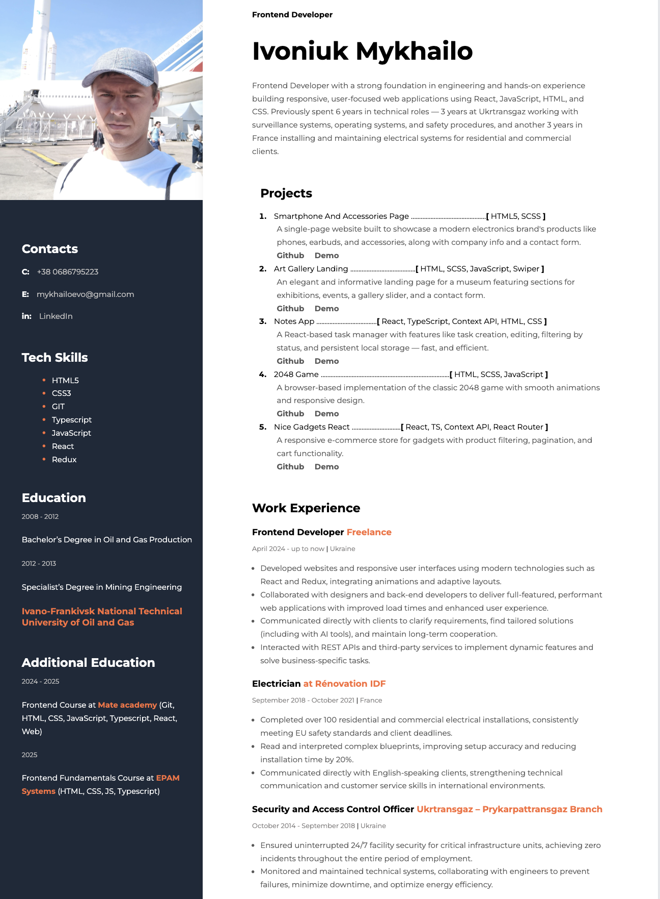

# Mykhailo Ivoniuk - Frontend Developer CV

Welcome to my personal CV repository! This project showcases my professional experience, portfolio, and skills as a Frontend Developer. The CV is built as a responsive web page using modern web technologies.

## 🚀 Live Demo
Check out the live version of my CV here:  
👉 [Mykhailo Ivoniuk's CV](https://miishca.github.io/cv/)

## 📖 About the Project
This is a single-page web application that serves as my professional resume. It highlights:
- **About Me**: My background as a Frontend Developer and previous technical experience.
- **Portfolio**: A collection of my projects with links to live demos and GitHub repositories.
- **Work Experience**: My professional journey, including freelance development and technical roles.
- **Skills**: My technical expertise in HTML5, CSS3, JavaScript, TypeScript, React, and more.
- **Education**: My academic background and additional courses in frontend development.

### Technologies Used
- **HTML5** & **CSS3** for structure and styling
- Hosted on **GitHub Pages**

## 📬 Contact Me
Feel free to reach out for collaboration or opportunities:

- 📞 **Phone**: [+38 0686795223](tel:+380686795223)
- 📧 **Email**: [mykhailoevo@gmail.com](mailto:mykhailoevo@gmail.com)
- 💼 **LinkedIn**: [Mykhailo Ivoniuk](https://www.linkedin.com/in/mykhailo-ivoniuk/)
- 🐙 **GitHub**: [Miishca](https://github.com/Miishca)
- 💬 **Telegram**: [@Mikeevo](https://t.me/Mikeevo)

## 🙌 Acknowledgments
- Thanks to [Mate Academy](https://mate.academy/en/) and [EPAM Systems](https://www.epam.com/) for their excellent frontend courses.
- Fonts provided by [Google Fonts](https://fonts.google.com/).

Built by Mykhailo Ivoniuk
